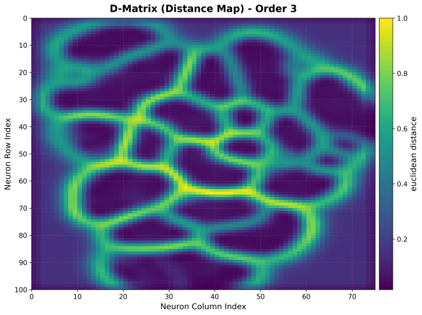
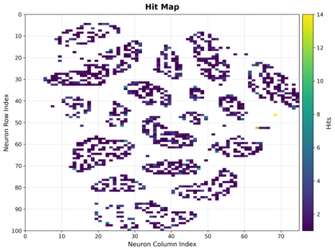
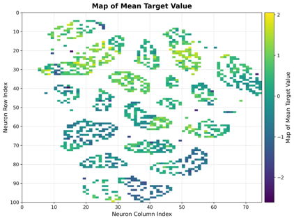
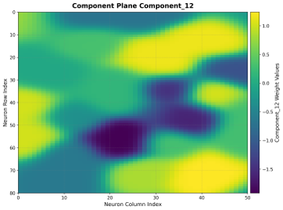
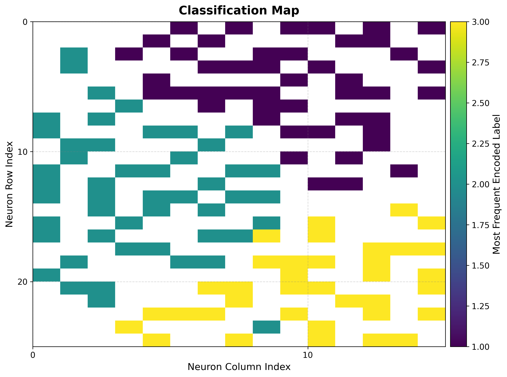
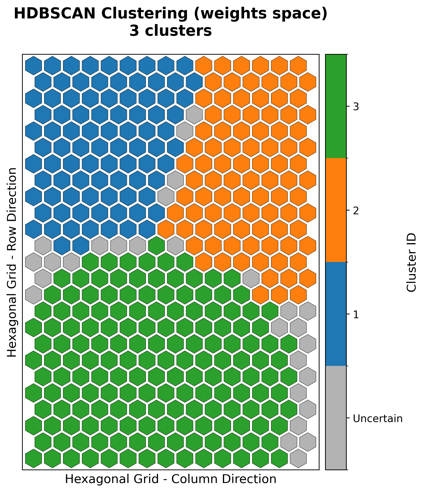
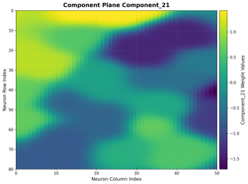
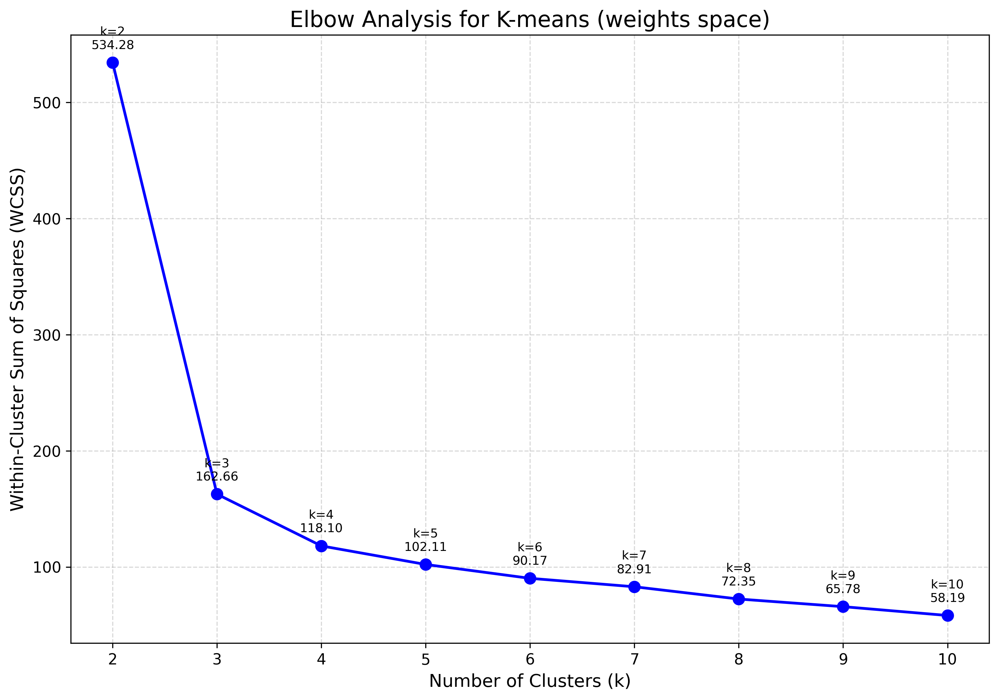
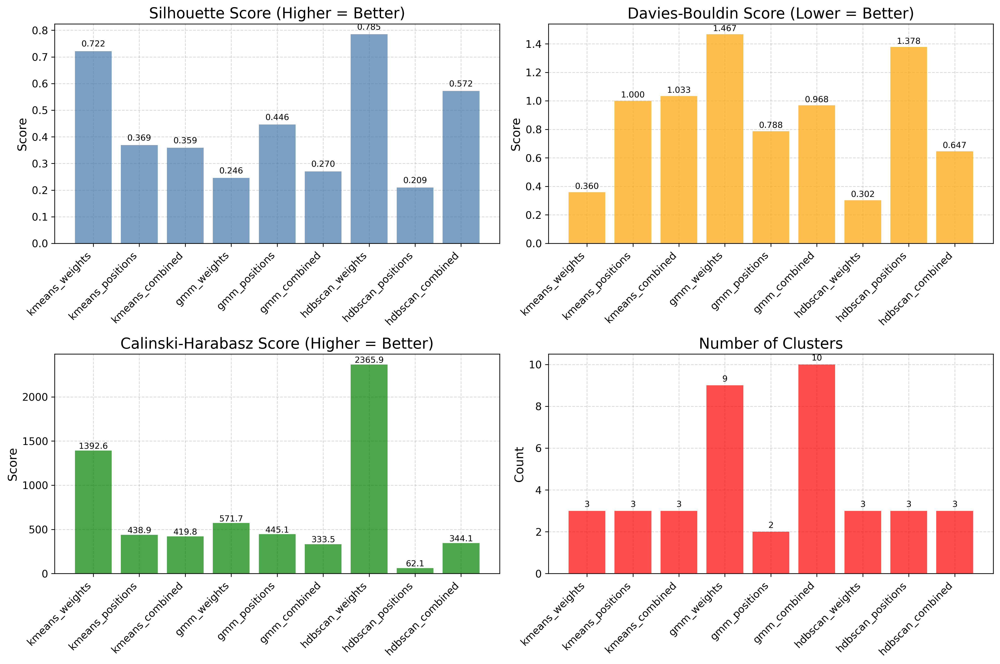

# `torchsom`: The Reference PyTorch Library for Self-Organizing Maps

<div align="center">

[](https://pypi.org/project/torchsom/)
[](https://pypi.org/project/torchsom/)
[](https://pytorch.org/)
[](https://opensource.org/license/apache-2-0)
[](https://arxiv.org/abs/2510.11147)

<!-- [](https://sonarcloud.
io/summary/new_code?id=michelin_TorchSOM)
[](https://
sonarcloud.io/summary/new_code?id=michelin_TorchSOM)
[](https://sonarcloud.io/
summary/new_code?id=michelin_TorchSOM)
[](https://
sonarcloud.io/summary/new_code?id=michelin_TorchSOM)
[](https://sonarcloud.io/summary/
new_code?id=michelin_TorchSOM) -->

[](https://github.com/michelin/TorchSOM/actions/workflows/test.yml)
[](https://github.com/michelin/TorchSOM/actions/workflows/code-quality.yml)
[](https://sonarcloud.io/summary/new_code?id=michelin_TorchSOM)
[](https://pepy.tech/project/torchsom)
[](https://github.com/michelin/TorchSOM)

<p align="center">
    
</p>

*GPU-accelerated Self-Organizing Maps in PyTorch with a scikit-learn API, rich visualization, and clustering --- from dimensionality reduction to Just-In-Time Learning.*

[Paper](https://arxiv.org/abs/2510.11147)
| [Documentation](https://opensource.michelin.io/TorchSOM/)
| [Quick Start](#quick-start)
| [Examples](notebooks/)
| [Contributing](CONTRIBUTING.md)

</div>

---

## Overview

[Self-Organizing Maps (SOMs)](https://en.wikipedia.org/wiki/Self-organizing_map) remain highly relevant in modern machine learning due to their **interpretability**, **topology preservation**, and **computational efficiency**. They are widely used in energy systems, biology, IoT, environmental science, and industrial applications.

Despite their utility, the Python SOM ecosystem is fragmented - existing implementations are often **outdated**, **unmaintained**, and **lack GPU acceleration** or integration with modern deep learning frameworks.

**`torchsom`** addresses these gaps as a **reference PyTorch library** for SOMs, providing:

- **GPU-accelerated training** via PyTorch CUDA backend
- **Advanced clustering** (K-Means, GMM, HDBSCAN) on the SOM latent space
- A **scikit-learn-style API** for ease of use and extensibility
- **Rich visualization tools** for both rectangular and hexagonal topologies
- **Just-In-Time Learning (JITL)** for supervised regression and classification

This library accompanies the paper: [*torchsom: The Reference PyTorch Library for Self-Organizing Maps*](https://arxiv.org/abs/2510.11147) (Berthier et al., 2025). If you use `torchsom` in academic or industrial work, please cite both the paper and the software (see [Citation](#citation)).

### Key Results

Benchmarked against [MiniSom](https://github.com/JustGlowing/minisom) on synthetic datasets (240–16,000 samples, 4–300 features) with identical hyperparameters:

| Metric | Improvement |
| --- | --- |
| **Training speed** | Up to **99% faster** (GPU) and **77–98% faster** (CPU) |
| **Topographic Error** | **34–81% lower** — better topology preservation |
| **Quantization Error** | Comparable fidelity across all configurations |

> Hardware: Intel Xeon Platinum 8370C (CPU), NVIDIA Tesla T4 (GPU). See the [paper](https://arxiv.org/abs/2510.11147) for full benchmark tables.

---

## How It Works

A SOM is an unsupervised neural network that maps high-dimensional data onto a low-dimensional grid (typically 2D) while preserving topological relationships. At each training step, the **Best Matching Unit (BMU)** — the neuron closest to the input — is identified, and its weights along with its neighbors are updated:

$$\mathbf{w}_{ij}(t+1) = \mathbf{w}_{ij}(t) + \alpha(t) \cdot h_{ij}(t) \cdot \bigl(\mathbf{x} - \mathbf{w}_{ij}(t)\bigr)$$

where $\alpha(t)$ is the learning rate, $h_{ij}(t)$ is a neighborhood function (e.g., Gaussian) centered on the BMU, and $\mathbf{x} \in \mathbb{R}^k$ is the input vector. The BMU is found by:

$$\text{BMU} = \underset{i,j}{\operatorname{argmin}}\, \lVert \mathbf{x} - \mathbf{w}_{ij} \rVert_2$$

Training quality is assessed via **Quantization Error** (representation fidelity) and **Topographic Error** (topology preservation). See the [documentation](https://opensource.michelin.io/TorchSOM/) for the full mathematical background.

---

## Why `torchsom`?

| | [torchsom](https://github.com/michelin/TorchSOM) | [MiniSom](https://github.com/JustGlowing/minisom) | [SimpSOM](https://github.com/fcomitani/simpsom) | [SOMPY](https://github.com/sevamoo/SOMPY) | [somoclu](https://github.com/peterwittek/somoclu) | [som-pbc](https://github.com/alexarnimueller/som) |
| --- | --- | --- | --- | --- | --- | --- |
| Framework | **PyTorch** | NumPy | NumPy | NumPy | C++/CUDA | NumPy |
| GPU Acceleration | ✅ CUDA | ❌ | ✅ CuPy/CUML | ❌ | ✅ CUDA | ❌ |
| API Design | **scikit-learn** | Custom | Custom | MATLAB | Custom | Custom |
| Maintenance | ✅ Active | ✅ Active | ⚠️ Minimal | ⚠️ Minimal | ⚠️ Minimal | ❌ |
| Documentation | ✅ Rich | ❌ | ⚠️ Basic | ❌ | ⚠️ Basic | ⚠️ Basic |
| Test Coverage | ✅ 90% | ❌ | ~53% | ❌ | Minimal | ❌ |
| Visualization | ✅ Advanced | ❌ | Moderate | Moderate | Basic | Basic |
| Clustering | ✅ Advanced | ❌ | ❌ | ❌ | ❌ | ❌ |
| JITL Support | ✅ Built-in | ❌ | ❌ | ❌ | ❌ | ❌ |
| SOM Variants | PBC, Growing*, Hierarchical* | ❌ | PBC | ❌ | PBC | PBC |

*\* Work in progress*

> **Just-In-Time Learning (JITL)**: Given an online query, JITL collects relevant samples by topology and distance to form a local buffer. A lightweight local model is then trained on this buffer, enabling efficient supervised learning (regression or classification).

---

## Quick Start

```python
import torch
from torchsom.core import SOM
from torchsom.visualization import SOMVisualizer

som = SOM(x=10, y=10, num_features=3, epochs=50)

X = torch.randn(1000, 3)
som.initialize_weights(data=X, mode="pca")
q_errors, t_errors = som.fit(data=X)

visualizer = SOMVisualizer(som=som)
visualizer.plot_training_errors(
    quantization_errors=q_errors, topographic_errors=t_errors
)
visualizer.plot_hit_map(data=X, batch_size=256)
visualizer.plot_distance_map(
    distance_metric=som.distance_fn_name,
    neighborhood_order=som.neighborhood_order,
    scaling="sum",
)
```

---

## Tutorials

Explore our collection of Jupyter notebooks:

| Notebook | Task | Dataset |
| --- | --- | --- |
| [`iris.ipynb`](notebooks/iris.ipynb) | Multiclass classification | Iris |
| [`wine.ipynb`](notebooks/wine.ipynb) | Multiclass classification | Wine |
| [`boston_housing.ipynb`](notebooks/boston_housing.ipynb) | Regression | Boston Housing |
| [`energy_efficiency.ipynb`](notebooks/energy_efficiency.ipynb) | Multi-output regression | Energy Efficiency |
| [`clustering.ipynb`](notebooks/clustering.ipynb) | Clustering analysis | Synthetic blobs |

### Visualization Gallery

<table>
  <tr>
    <td align="center"><b>D-Matrix (U-Matrix)</b><br><sub>Inter-neuron distances</sub><br></td>
    <td align="center"><b>Hit Map</b><br><sub>BMU activation frequency</sub><br></td>
    <td align="center"><b>Mean Map</b><br><sub>Target value distribution</sub><br></td>
  </tr>
  <tr>
    <td align="center"><b>Component Planes</b><br><sub>Feature-wise weight distribution</sub><br></td>
    <td align="center"><b>Classification Map</b><br><sub>Dominant class per neuron</sub><br></td>
    <td align="center"><b>HDBSCAN Cluster Map</b><br><sub>Cluster assignment</sub><br></td>
  </tr>
  <tr>
    <td align="center"><b>Component Planes</b><br><sub>Another feature dimension</sub><br></td>
    <td align="center"><b>K-Means Elbow</b><br><sub>Optimal cluster selection</sub><br></td>
    <td align="center"><b>Cluster Quality Metrics</b><br><sub>Algorithm comparison</sub><br></td>
  </tr>
</table>

---

## Installation

This project uses [`uv`](https://docs.astral.sh/uv/) for fast, reproducible dependency management.

### From PyPI

```bash
# With uv (recommended)
uv add torchsom

# With pip
pip install torchsom
```

With optional [FAISS](https://github.com/facebookresearch/faiss) acceleration for BMU search:

```bash
uv add torchsom[faiss]
```

### Development Setup

```bash
git clone https://github.com/michelin/TorchSOM.git
cd TorchSOM
uv sync --all-extras      # creates .venv and installs everything
```

All Make targets use `uv run` so the correct environment is always activated:

```bash
make help                  # see all available commands
make cov                   # run tests with coverage
make check                 # lint / type-check
make fix                   # auto-format
make docs                  # build documentation
```

---

## Documentation

Comprehensive documentation is available at **[opensource.michelin.io/TorchSOM](https://opensource.michelin.io/TorchSOM/)**, including:

- **Getting Started**: installation, quick start, SOM concepts
- **User Guide**: visualization, architecture, benchmarks
- **API Reference**: core, utils, visualization, configs
- **Additional Resources**: FAQ, troubleshooting, changelog

---

## Citation

If you use `torchsom` in your academic, research, or industrial work, please cite both the paper and the software:

```bibtex
@misc{berthier2025torchsom,
    title={torchsom: The Reference PyTorch Library for Self-Organizing Maps},
    author={Berthier, Louis and Shokry, Ahmed and Moreaud, Maxime
            and Ramelet, Guillaume and Moulines, Eric},
    year={2025},
    eprint={2510.11147},
    archivePrefix={arXiv},
    primaryClass={stat.ML},
    note={Preprint submitted to Journal of Machine Learning Research},
    url={https://arxiv.org/abs/2510.11147}
}

@software{berthier2025torchsom_software,
    author={Berthier, Louis},
    title={torchsom: The Reference PyTorch Library for Self-Organizing Maps},
    year={2025},
    version={1.1.1},
    url={https://github.com/michelin/TorchSOM},
    note={Documentation available at \url{https://opensource.michelin.io/TorchSOM/}}
}
```

For more details, see the [CITATION](CITATION.cff) file.

---

## Contributing

We welcome contributions from the community! See our [Contributing Guide](CONTRIBUTING.md) and [Code of Conduct](CODE_OF_CONDUCT.md) for details.

- **GitHub Issues**: [Report bugs or request features](https://github.com/michelin/TorchSOM/issues)

---

## Acknowledgments

- [Centre de Mathématiques Appliquées (CMAP)](https://cmap.ip-paris.fr/) at École Polytechnique
- [Manufacture Française des Pneumatiques Michelin](https://www.michelin.com/) for collaboration
- [Giuseppe Vettigli](https://github.com/JustGlowing) for [MiniSom](https://github.com/JustGlowing/minisom) inspiration
- The [PyTorch](https://pytorch.org/) team for the amazing framework

---

## License

`torchsom` is licensed under the [Apache License 2.0](LICENSE). See the [LICENSE](LICENSE) file for details.

---

## Related Work and References

### Foundational Literature

- Kohonen, T. (1982). [Self-organized formation of topologically correct feature maps](https://doi.org/10.1007/BF00337288). *Biological Cybernetics*, 43(1), 59–69.
- Kohonen, T. (1990). [The self-organizing map](https://doi.org/10.1109/5.58325). *Proceedings of the IEEE*, 78(9), 1464–1480.
- Kohonen, T. (2001). [Self-Organizing Maps](https://link.springer.com/book/10.1007/978-3-642-56927-2). Springer.

### Related Software

- [MiniSom](https://github.com/JustGlowing/minisom): Minimalistic Python SOM
- [SimpSOM](https://github.com/fcomitani/simpsom): Simple Self-Organizing Maps
- [SOMPY](https://github.com/sevamoo/SOMPY): Python SOM library
- [somoclu](https://github.com/peterwittek/somoclu): Massively Parallel Self-Organizing Maps
- [som-pbc](https://github.com/alexarnimueller/som): SOM with periodic boundary conditions
- [SOM Toolbox](http://www.cis.hut.fi/projects/somtoolbox/): MATLAB implementation

---
