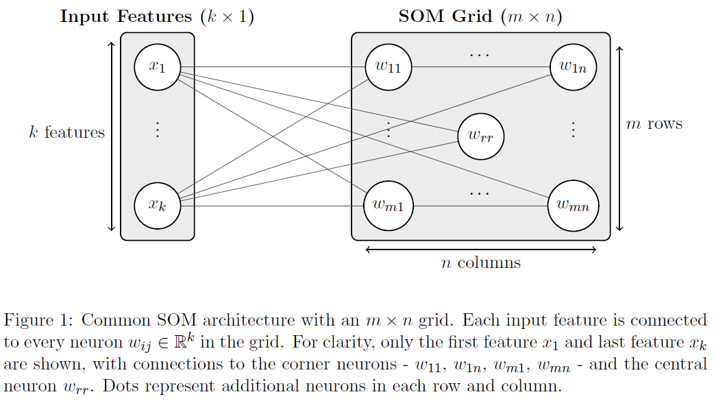
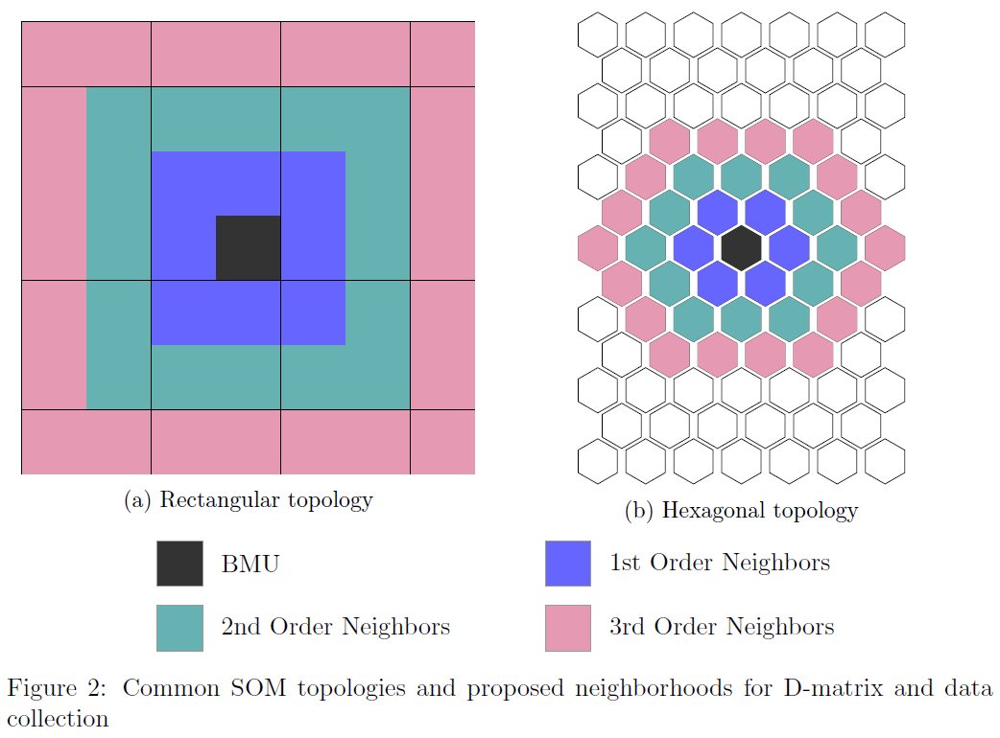

Basic Concepts
==============

This page introduces the fundamental concepts behind Self-Organizing Maps (SOMs) and how they work.

What is a Self-Organizing Map?
------------------------------

A **Self-Organizing Map (SOM)**, also known as a Kohonen map, is an unsupervised neural network algorithm that:

- **Clusters** similar data points together
- **Reduces dimensionality** by mapping high-dimensional data to a lower-dimensional grid, usually 2D
- **Preserves topology** by keeping similar data points close together on the map
- **Visualizes patterns** in complex, high-dimensional datasets

**Key Characteristics**:

- **Unsupervised**: No labeled data required
- **Competitive learning**: Neurons compete to represent input data
- **Topology preservation**: Maintains neighborhood relationships
- **Dimensionality reduction**: Maps N-dimensional data to 2D grid

How SOMs Work
-------------

The SOM Algorithm
~~~~~~~~~~~~~~~~~

1. **Initialize** weight vectors randomly for each neuron
2. **Present** input data to the network
3. **Find** the Best Matching Unit (BMU) - the neuron most similar to input
4. **Update** the BMU and its neighbors to be more similar to the input
5. **Repeat** until convergence or maximum iterations reached

Mathematical Foundation
~~~~~~~~~~~~~~~~~~~~~~~

**Distance Calculation**
The similarity between an input vector :math:`\mathbf{x}` and a neuron's weight vector :math:`\mathbf{w}` is most commonly measured using the Euclidean distance.
Alternative distance functions are also supported; see :ref:`distance_functions_section` for a comprehensive list.

.. math::
   \text{BMU} = w_{\mathrm{bmu}} = \underset{i,j}{\operatorname{argmin}}\, \| \mathbf{x} - \mathbf{w}_{ij} \|_2 = \underset{i,j}{\operatorname{argmin}}\, \sqrt{\sum_{l=1}^{k} (x_l - w_{ij,l})^2}

**Weight Update Rule**
The weights of the neurons are updated according to the following rule:

.. math::
   \mathbf{w}_{ij}(t+1) = \mathbf{w}_{ij}(t) + \alpha(t) \cdot h_{ij}(t) \cdot (\mathbf{x} - \mathbf{w}_{ij}(t))

where:

- :math:`\mathbf{w}_{ij}(t) \in \mathbb{R}^k`: weight vector of the neuron at row :math:`i`, column :math:`j` at iteration :math:`t`
- :math:`\alpha(t) \in \mathbb{R}`: learning rate at iteration :math:`t`
- :math:`h_{ij}(t) \in \mathbb{R}`: neighborhood function value for neuron :math:`(i, j)` at iteration :math:`t`
- :math:`\mathbf{x} \in \mathbb{R}^k`: input feature vector

Core Components
---------------

1. Grid Topology
~~~~~~~~~~~~~~~~

SOMs arrange neurons in a regular grid structure, which determines the map's topology and neighborhood relationships:

**Rectangular Grid**
   - Simple, intuitive visualization
   - Suitable for most applications

**Hexagonal Grid**
   - Uniform neighborhood distances
   - Reduces topology errors, often preferred for advanced analysis

2. Neighborhood Function
~~~~~~~~~~~~~~~~~~~~~~~~

The neighborhood function determines how much each neuron is influenced by the BMU during weight updates:

**Gaussian** (most common):
   .. math::
      h_{ij}^{\mathrm{Gaussian}}(t) = \exp\left(-\frac{d_{ij}^2}{2\,\sigma(t)^2}\right)

**Mexican Hat**:
   .. math::
      h_{ij}^{\mathrm{Mexican}}(t) = \frac{1}{\pi\,\sigma(t)^4} \left(1 - \frac{d_{ij}^2}{2\,\sigma(t)^2}\right) \exp\left(-\frac{d_{ij}^2}{2\,\sigma(t)^2}\right)

**Bubble**:
   .. math::
      h_{ij}^{\mathrm{Bubble}}(t) = \begin{cases}
         1, & \text{if } d_{ij} \leq \sigma(t) \\
         0, & \text{otherwise}
      \end{cases}

**Triangle**:
   .. math::
      h_{ij}^{\mathrm{Triangle}}(t) = \max\left(0,\, 1 - \frac{d_{ij}}{\sigma(t)}\right)

When updating neuron weights, the distance :math:`d_{ij}` is computed in the grid (map) space, not in the input feature space:

.. math::
   d_{ij} = \sqrt{(i - c_x)^2 + (j - c_y)^2}

where:

- :math:`(c_x, c_y)`: coordinates of the BMU in the grid
- :math:`(i, j)`: coordinates of neuron :math:`w_{ij}`

3. Schedule Learning Rate and Neighborhood Radius Decay
~~~~~~~~~~~~~~~~~~~~~~~~~~~~~~~~~~~~~~~~~~~~~~~~~~~~~~~

Learning Rate Decay
^^^^^^^^^^^^^^^^^^^

The learning rate :math:`\alpha(t)` controls the magnitude of weight vector updates during training, directly influencing convergence speed and final map quality.

**Inverse Decay**:
   .. math::
      \alpha(t+1) = \alpha(t) \cdot \frac{\gamma}{\gamma + t} % , \quad \text{where } \gamma = \frac{T}{100}

**Linear Decay**:
   .. math::
      \alpha(t+1) = \alpha(t) \cdot \left( 1 - \frac{t}{T} \right)

These schedulers guarantee convergence to :math:`\alpha(T) = 0`, corresponding to zero weight updates in the final training phase, which is essential for achieving precise local weight adjustments.

Neighborhood Radius Decay
^^^^^^^^^^^^^^^^^^^^^^^^^

The neighborhood radius controls the size of the neighborhood of the BMU during weight updates.

**Inverse Decay**:
   .. math::
      \sigma(t+1) = \frac{\sigma(t)}{1 + t \cdot \frac{\sigma(t) - 1}{T}}

**Linear Decay**:
   .. math::
      \sigma(t+1) = \sigma(t) + t \cdot \frac{1 - \sigma(t)}{T}

These schedulers guarantee convergence to :math:`\sigma(T) = 1`, corresponding to single-neuron updates in the final training phase, which is essential for achieving precise local weight adjustments.

Asymptotic Decay
^^^^^^^^^^^^^^^^

For arbitrary dynamic parameters requiring exponential-like decay characteristics, TorchSOM implements a general asymptotic decay scheduler:

.. math::
   \theta(t+1) = \frac{\theta(t)}{1 + \frac{t}{T/2}}

where:

- :math:`\alpha(t) \in \mathbb{R}^+`: learning rate at iteration :math:`t`
- :math:`\sigma(t) \in \mathbb{R}^+`: neighborhood function width at iteration :math:`t`
- :math:`\theta(t) \in \mathbb{R}^+`: general dynamic parameter at iteration :math:`t`
- :math:`T \in \mathbb{N}`: total number of training iterations
- :math:`t \in \{0, 1, \ldots, T\}`: current iteration index
- :math:`\gamma \in \mathbb{R}^+`: inverse decay rate parameter, typically :math:`\gamma = T/100`

.. _distance_functions_section:

4. Distance Functions
~~~~~~~~~~~~~~~~~~~~~

Different ways to measure similarity:

**Euclidean**:
   .. math::
      d_{\text{Euclidean}}(x, w_{ij}) = \sqrt{\sum_{l=1}^k {(x_l - w_{ij,l})}^2}

**Cosine**:
   .. math::
      d_{\text{cosine}}(x, w_{ij}) = 1 - \frac{x \cdot w_{ij}}{\|x\| \|w_{ij}\|}

**Manhattan**:
   .. math::
      d_{\text{Manhattan}}(x, w_{ij}) = \sum_{l=1}^k |x_l - w_{ij,l}|

**Chebyshev**:
   .. math::
      d_{\text{Chebyshev}}(x, w_{ij}) = \max_{l} |x_l - w_{ij,l}|

where:
   - :math:`x \in \mathbb{R}^k`: input feature vector
   - :math:`w_{ij} \in \mathbb{R}^k`: weight vector of the neuron at row :math:`i`, column :math:`j`
   - :math:`k \in \mathbb{N}`: number of features
   - :math:`l \in \{1, \ldots, k\}`: feature index

5. Quality Metrics
~~~~~~~~~~~~~~~~~~

**Quantization Error**
Average distance between data points and their BMUs. Lower is better, measures how well the map represents the data.

**Quantization Error**

Average distance between data points and their BMUs. Lower is better; measures how well the map represents the data.

.. math::

   \mathrm{QE} = \frac{1}{N} \sum_{i=1}^{N} \left\| x_i - w_{\mathrm{BMU}}(x_i) \right\|_2

**Topographic Error**

Percentage of data points whose BMU and second-BMU are not neighbors. Lower is better; measures topology preservation.

.. math::

   \mathrm{TE} = \frac{1}{N} \sum_{i=1}^{N} \mathbb{I} \left( d_{\mathrm{grid}} \left( w_{\mathrm{BMU}}(x_i),\ w_{\mathrm{2nd\text{-}BMU}}(x_i) \right) > d_{\mathrm{th}} \right )

where:

   - :math:`N \in \mathbb{N}`: Number of training samples
   - :math:`x_i \in \mathbb{R}^k`: The :math:`i`-th input training sample
   - :math:`w_{\text{BMU}}(x_i) \in \mathbb{R}^k`: Weight vector of the Best Matching Unit (BMU) for input :math:`x_i`
   - :math:`w_{\text{2nd-BMU}}(x_i) \in \mathbb{R}^k`: Weight vector of the second BMU for input :math:`x_i`
   - :math:`d_{\text{th}} \in \mathbb{R}^+`: Threshold distance for topological adjacency (typically :math:`d_{\text{th}} = 1`)
   - :math:`\mathbb{I}(\cdot) \in \{0, 1\}`: Indicator function
   - :math:`\| \cdot \|_2`: Euclidean norm in feature space
   - :math:`d_{\text{grid}}(\cdot, \cdot)`: Grid space distance between BMUs of input :math:`x_i`

Strengths and Weaknesses
------------------------

Advantages
~~~~~~~~~~

- **No assumptions** about data distribution
- **Topology preservation** maintains relationships
- **Intuitive visualization** of complex data
- **Unsupervised learning** - no labels needed

Limitations
~~~~~~~~~~~

- **Calculations can be expensive** for large datasets
- **Parameter selection is important** - requires tuning
- **Interpretation challenges** for very high dimensions

Best Practices
--------------

Data Preparation
~~~~~~~~~~~~~~~~

1. **Normalize features** to similar scales
2. **Remove highly correlated** features
3. **Handle missing values** appropriately
4. **Consider dimensionality reduction** for very high dimensions

Parameter Selection
~~~~~~~~~~~~~~~~~~~

1. **Experiment with different** topologies and functions
2. **Monitor training progress** with error curves to guide parameter choice

Interpretation
~~~~~~~~~~~~~~

1. **Use multiple visualizations** to understand the map
2. **Combine with domain knowledge** for meaningful insights
3. **Validate findings** with other analysis methods
4. **Document parameter choices** for reproducibility

Next Steps
----------

Now that you understand the basics, explore:

- :doc:`../user_guide/visualization_help` - Visualization techniques
