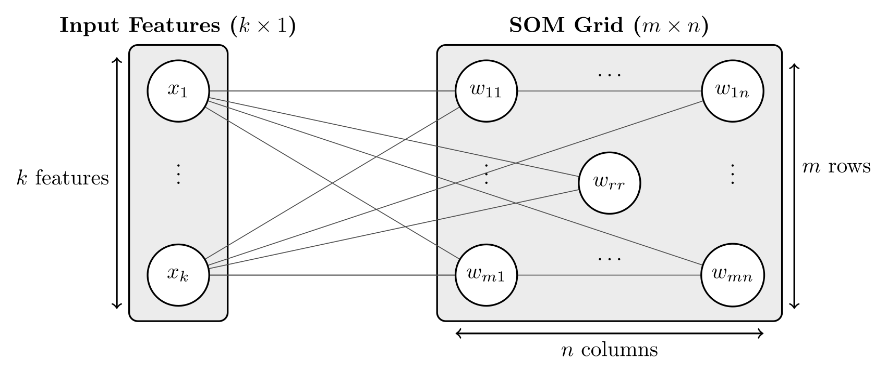
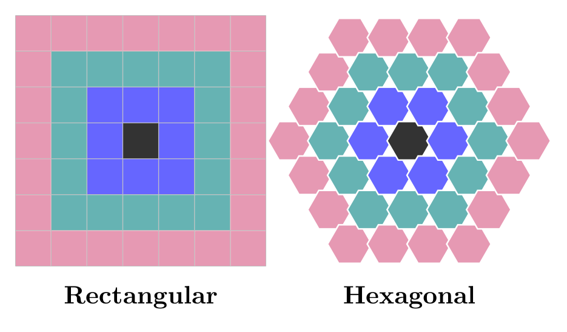

Basic Concepts
==============

This page introduces the fundamental concepts behind Self-Organizing Maps (SOMs) and how they work.

What is a Self-Organizing Map?
------------------------------

A **Self-Organizing Map (SOM)**, also known as a Kohonen map, is an unsupervised neural network algorithm that:

- **Clusters** similar data points together
- **Reduces dimensionality** by mapping high-dimensional data to a lower-dimensional grid, usually 2D
- **Preserves topology** by keeping similar data points close together on the map
- **Visualizes patterns** in complex, high-dimensional datasets

**Key Characteristics**:

- **Unsupervised**: No labeled data required
- **Competitive learning**: Neurons compete to represent input data
- **Topology preservation**: Maintains neighborhood relationships
- **Dimensionality reduction**: Maps N-dimensional data to 2D grid

How SOMs Work
-------------

The SOM Algorithm
~~~~~~~~~~~~~~~~~

1. **Initialize** weight vectors randomly for each neuron
2. **Present** input data to the network
3. **Find** the Best Matching Unit (BMU) - the neuron most similar to input
4. **Update** the BMU and its neighbors to be more similar to the input
5. **Repeat** until convergence or maximum iterations reached

Mathematical Foundation
~~~~~~~~~~~~~~~~~~~~~~~

**Setup and notation**
A SOM approximates a distribution over an input space :math:`\mathcal{X} \subseteq \mathbb{R}^d` by a two-dimensional lattice of :math:`I \times J` neurons.
Each neuron at grid position :math:`(i, j)`, with :math:`i \in \{1, \dots, I\}` and :math:`j \in \{1, \dots, J\}`, carries a *codebook* (weight) vector :math:`\mathbf{w}_{ij} \in \mathbb{R}^l` with :math:`l = d`, and the full parameter set is the tensor

.. math::
   \mathbf{W} \coloneqq [\mathbf{w}_{ij}]_{i \le I,\, j \le J} \in \mathbb{R}^{I \times J \times l}

Training uses a data set :math:`\{\mathbf{x}_k\}_{k=1}^{N} \subset \mathbb{R}^d` over epochs :math:`t \in \{0, 1, \dots, T\}`.

**Best matching unit and projection**
Similarity in feature space is measured by a distance :math:`\delta` (see :ref:`distance_functions_section`).
For an input :math:`\mathbf{x}`, the Best Matching Unit (BMU) is the neuron whose codebook minimizes :math:`\delta`:

.. math::
   \mathrm{BMU}(\mathbf{x}) \coloneqq \operatorname*{arg\,min}_{(i,j)}\, \delta(\mathbf{x}, \mathbf{w}_{ij})

which induces a projection onto grid coordinates and a latent codebook retrieval:

.. math::
   \psi : \mathbb{R}^d \rightarrow \{1, \dots, I\} \times \{1, \dots, J\}, \qquad \psi(\mathbf{x}) \coloneqq \mathrm{BMU}(\mathbf{x}), \qquad \mathbf{z} \coloneqq \mathbf{w}_{\psi(\mathbf{x})} \in \mathbb{R}^l

The latent vector :math:`\mathbf{z}` is the representation used for clustering, visualization, and just-in-time learning (JITL) retrieval.

**Competitive update**
A SOM learns by a neighborhood-weighted competitive rule rather than gradient descent: at each step the BMU for the presented sample :math:`\mathbf{x}` is found, and each neuron is moved toward :math:`\mathbf{x}` by a step scaled by its grid proximity to the BMU:

.. math::
   \mathbf{w}_{ij}(t+1) \coloneqq \mathbf{w}_{ij}(t) + \alpha(t)\, h_{ij}(t)\, (\mathbf{x} - \mathbf{w}_{ij}(t))

where:

- :math:`\mathbf{w}_{ij}(t) \in \mathbb{R}^l`: codebook vector of neuron :math:`(i, j)` at epoch :math:`t`
- :math:`\alpha(t) \in \mathbb{R}^+`: learning rate at epoch :math:`t` (see the decay schedules below)
- :math:`h_{ij}(t) \in \mathbb{R}`: neighborhood weight for neuron :math:`(i, j)` at epoch :math:`t`
- :math:`\mathbf{x} \in \mathbb{R}^d`: input feature vector

Core Components
---------------

.. _grid_topology_section:

1. Grid Topology
~~~~~~~~~~~~~~~~

SOMs arrange neurons in a regular grid structure, which determines the map's topology and neighborhood relationships:

**Rectangular Grid**
   - Simple, intuitive visualization
   - Suitable for most applications

**Hexagonal Grid**
   - Uniform neighborhood distances
   - Reduces topology errors, often preferred for advanced analysis

**Periodic Boundary Conditions (PBC)**
   - Available for both rectangular and hexagonal grids
   - Opposite edges of the map are identified, eliminating boundary artifacts at the borders
   - Useful when the input space has no natural boundary (e.g., cyclic features, angular data)
     or when uniform neuron utilization is required across the entire map

Under periodic boundary conditions, grid distances follow the minimum-image convention:

.. math::
   d_{\mathrm{grid}}\big((i,j),(i',j')\big) \coloneqq \min_{\mathbf{s} \in \mathcal{S}} \big\lVert \gamma(i,j) - \gamma(i',j') + \mathbf{s} \big\rVert_2

where :math:`\gamma(\cdot)` maps a grid index to its coordinates and :math:`\mathcal{S}` enumerates translations by the grid periods (:math:`\mathcal{S} = \{\mathbf{0}\}` without PBC), so neighborhoods wrap across boundaries and corner neurons are not penalized.

2. Neighborhood Function
~~~~~~~~~~~~~~~~~~~~~~~~

The neighborhood function determines how much each neuron is influenced by the BMU during weight updates.
Let :math:`\rho \coloneqq d_{\mathrm{grid}}\big((i, j), \mathrm{BMU}\big)` denote the *grid-space* distance from neuron :math:`(i, j)` to the BMU, induced by the lattice geometry. TorchSOM provides four neighborhood kernels of width :math:`\sigma(t)`:

**Gaussian** (most common):
   .. math::
      h_{ij}^{\mathrm{gaussian}}(t) \coloneqq \exp\left(-\frac{\rho^2}{2\,\sigma(t)^2}\right)

**Mexican hat** (the Ricker wavelet rescaled to a unit peak; it dips below zero in an outer ring, so :math:`h_{ij}(t) \in \mathbb{R}`):
   .. math::
      h_{ij}^{\mathrm{mexican}}(t) \coloneqq \left(1 - \frac{\rho^2}{4\,\sigma(t)^2}\right) \exp\left(-\frac{\rho^2}{2\,\sigma(t)^2}\right)

**Bubble**:
   .. math::
      h_{ij}^{\mathrm{bubble}}(t) \coloneqq \mathbb{I}\big(\rho \le \sigma(t)\big)

**Triangle**:
   .. math::
      h_{ij}^{\mathrm{triangle}}(t) \coloneqq \max\left(0,\, 1 - \frac{\rho}{\sigma(t)}\right)

The grid distance is computed in the map space, not the input feature space. On a rectangular grid it is Euclidean in the neuron coordinates,

.. math::
   \rho = \sqrt{(i - c_i)^2 + (j - c_j)^2}

where :math:`(c_i, c_j)` are the BMU coordinates and :math:`(i, j)` those of neuron :math:`\mathbf{w}_{ij}` (periodic boundaries wrap this distance; see :ref:`grid_topology_section`).

Discrete neighborhoods are controlled by an integer **order** :math:`o \in \mathbb{N}^+`. On a rectangular grid, the order-:math:`o` neighborhood of the BMU at :math:`(i, j)` is the Chebyshev ball

.. math::
   N_o(\mathrm{BMU}) \coloneqq \big\{ (i', j') : \max(|i' - i|,\, |j' - j|) \le o \big\}

a :math:`(2o + 1) \times (2o + 1)` block of neurons; the hexagonal grid uses the analogous hop-distance rings. The order :math:`o` sets the support of the discrete weight update and the sample-retrieval neighborhoods used for JITL (the ``neighborhood_order`` parameter and the ``collect_samples`` retrieval modes).

3. Schedule Learning Rate and Neighborhood Radius Decay
~~~~~~~~~~~~~~~~~~~~~~~~~~~~~~~~~~~~~~~~~~~~~~~~~~~~~~~

Learning Rate Decay
^^^^^^^^^^^^^^^^^^^

The learning rate :math:`\alpha(t)` controls the magnitude of weight vector updates during training, directly influencing convergence speed and final map quality.

**Inverse Decay**:
   .. math::
      \alpha(t+1) \coloneqq \alpha(t) \cdot \frac{\gamma}{\gamma + t}

**Linear Decay**:
   .. math::
      \alpha(t+1) \coloneqq \alpha(t) \cdot \left( 1 - \frac{t}{T} \right)

These schedulers guarantee convergence to :math:`\alpha(T) = 0`, corresponding to zero weight updates in the final training phase, which is essential for achieving precise local weight adjustments.

Neighborhood Radius Decay
^^^^^^^^^^^^^^^^^^^^^^^^^

The neighborhood radius controls the size of the neighborhood of the BMU during weight updates.

**Inverse Decay**:
   .. math::
      \sigma(t+1) \coloneqq \frac{\sigma(t)}{1 + t \cdot \frac{\sigma(t) - 1}{T}}

**Linear Decay**:
   .. math::
      \sigma(t+1) \coloneqq \sigma(t) + t \cdot \frac{1 - \sigma(t)}{T}

These schedulers guarantee convergence to :math:`\sigma(T) = 1`, corresponding to single-neuron updates in the final training phase, which is essential for achieving precise local weight adjustments.

Asymptotic Decay
^^^^^^^^^^^^^^^^

For arbitrary dynamic parameters requiring exponential-like decay characteristics, TorchSOM implements a general asymptotic decay scheduler:

.. math::
   \theta(t+1) \coloneqq \frac{\theta(t)}{1 + \frac{t}{T/2}}

where:

- :math:`\alpha(t) \in \mathbb{R}^+`: learning rate at iteration :math:`t`
- :math:`\sigma(t) \in \mathbb{R}^+`: neighborhood function width at iteration :math:`t`
- :math:`\theta(t) \in \mathbb{R}^+`: general dynamic parameter at iteration :math:`t`
- :math:`T \in \mathbb{N}`: total number of training iterations
- :math:`t \in \{0, 1, \ldots, T\}`: current iteration index
- :math:`\gamma \in \mathbb{R}^+`: inverse decay rate parameter, typically :math:`\gamma = T/100`

.. _distance_functions_section:

4. Distance Functions
~~~~~~~~~~~~~~~~~~~~~

The feature-space distance :math:`\delta` used by the BMU search is configurable. Writing :math:`x_a` and :math:`w_a` for the :math:`a`-th components:

**Euclidean**:
   .. math::
      \delta_{\mathrm{euclidean}}(\mathbf{x}, \mathbf{w}) \coloneqq \sqrt{\sum_{a=1}^{d} (x_a - w_a)^2}

**Manhattan**:
   .. math::
      \delta_{\mathrm{manhattan}}(\mathbf{x}, \mathbf{w}) \coloneqq \sum_{a=1}^{d} |x_a - w_a|

**Cosine**:
   .. math::
      \delta_{\mathrm{cosine}}(\mathbf{x}, \mathbf{w}) \coloneqq 1 - \frac{\mathbf{x} \cdot \mathbf{w}}{\lVert \mathbf{x} \rVert\, \lVert \mathbf{w} \rVert}

**Chebyshev**:
   .. math::
      \delta_{\mathrm{chebyshev}}(\mathbf{x}, \mathbf{w}) \coloneqq \max_{a \le d} |x_a - w_a|

where :math:`\mathbf{x}, \mathbf{w} \in \mathbb{R}^d` and :math:`d \in \mathbb{N}` is the number of features.

5. Quality Metrics
~~~~~~~~~~~~~~~~~~

**Quantization Error (QE)**

Average distance between data points and their BMUs. Lower is better; it measures how well the map represents the data.

.. math::
   \mathrm{QE} \coloneqq \frac{1}{N} \sum_{k=1}^{N} \big\lVert \mathbf{x}_k - \mathbf{w}_{\mathrm{BMU}(\mathbf{x}_k)} \big\rVert_2

**Topographic Error (TE)**

Fraction of data points whose BMU and second-BMU are not grid-adjacent. Lower is better; it measures topology preservation.

.. math::
   \mathrm{TE} \coloneqq \frac{1}{N} \sum_{k=1}^{N} \mathbb{I}\big( d_{\mathrm{grid}}(\mathrm{BMU}(\mathbf{x}_k),\, \mathrm{BMU}_2(\mathbf{x}_k)) > d_{\mathrm{th}} \big)

where:

   - :math:`N \in \mathbb{N}`: number of training samples
   - :math:`\mathbf{x}_k \in \mathbb{R}^d`: the :math:`k`-th input sample
   - :math:`\mathrm{BMU}_2(\mathbf{x}_k)`: the second-closest neuron in feature space
   - :math:`d_{\mathrm{th}} \in \mathbb{R}^+`: grid-adjacency threshold (typically :math:`d_{\mathrm{th}} = 1`)
   - :math:`\mathbb{I}(\cdot) \in \{0, 1\}`: indicator function

Strengths and Weaknesses
------------------------

Advantages
~~~~~~~~~~

- **No assumptions** about data distribution
- **Topology preservation** maintains relationships
- **Intuitive visualization** of complex data
- **Unsupervised learning** - no labels needed

Limitations
~~~~~~~~~~~

- **Calculations can be expensive** for large datasets
- **Parameter selection is important** - requires tuning
- **Interpretation challenges** for very high dimensions

Best Practices
--------------

Data Preparation
~~~~~~~~~~~~~~~~

1. **Normalize features** to similar scales
2. **Remove highly correlated** features
3. **Handle missing values** appropriately
4. **Consider dimensionality reduction** for very high dimensions

Parameter Selection
~~~~~~~~~~~~~~~~~~~

1. **Experiment with different** topologies and functions
2. **Monitor training progress** with error curves to guide parameter choice

Interpretation
~~~~~~~~~~~~~~

1. **Use multiple visualizations** to understand the map
2. **Combine with domain knowledge** for meaningful insights
3. **Validate findings** with other analysis methods
4. **Document parameter choices** for reproducibility

Next steps
----------

Now that you understand the basics, explore:

- :doc:`../user_guide/architecture` — How these concepts map to the package structure and APIs
- :doc:`../user_guide/topologies` — Choosing a topology and periodic boundary conditions
- :doc:`../user_guide/training` — Decay schedules and training configuration
- :doc:`../user_guide/visualization_help` — Visualization gallery
- :doc:`quickstart` — A minimal end-to-end example
